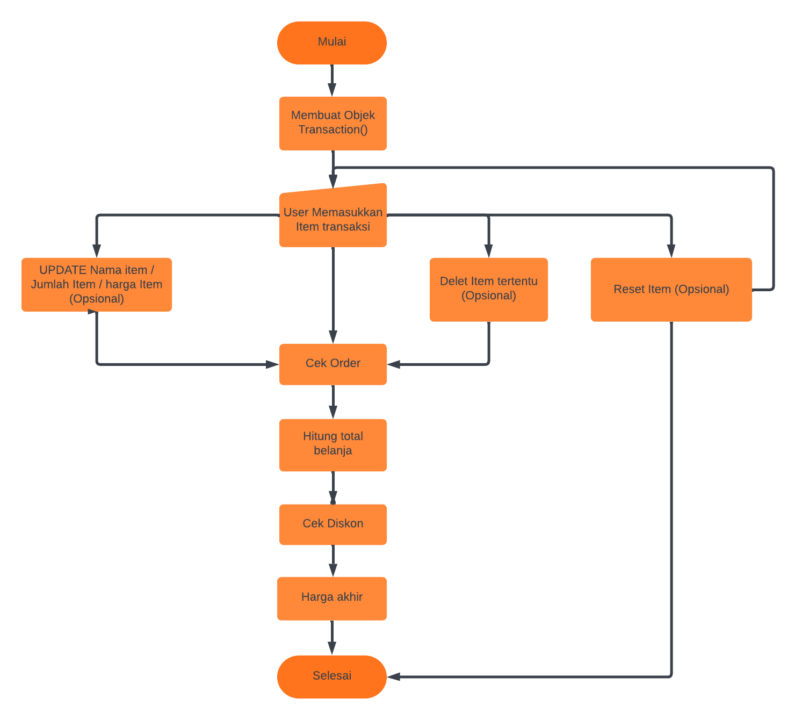
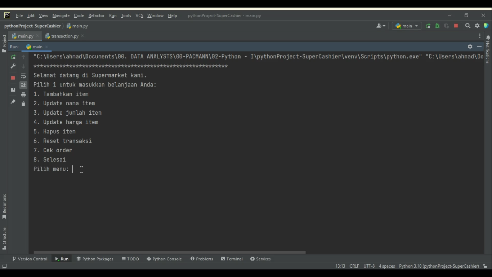
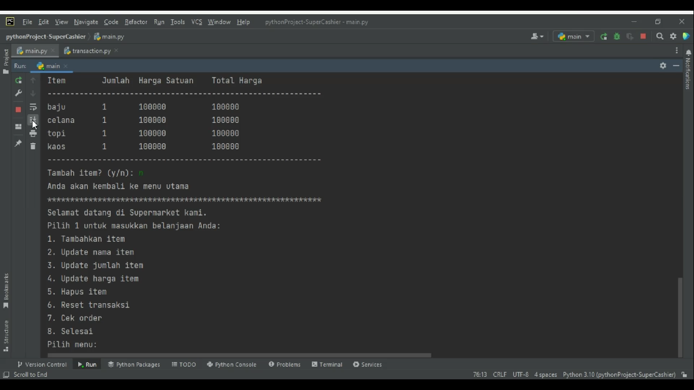
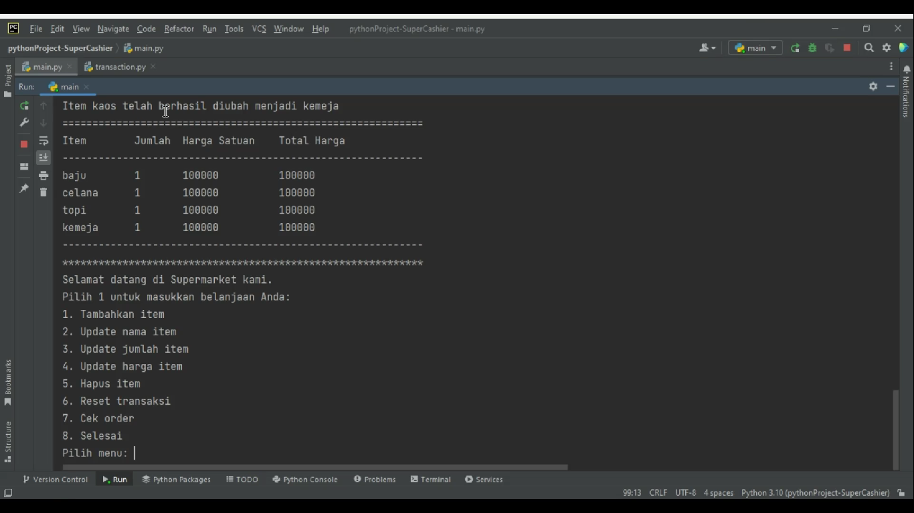
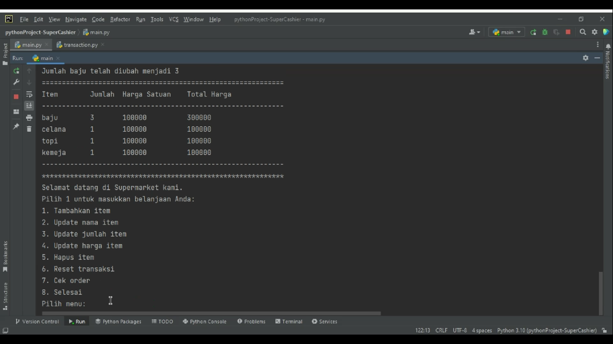
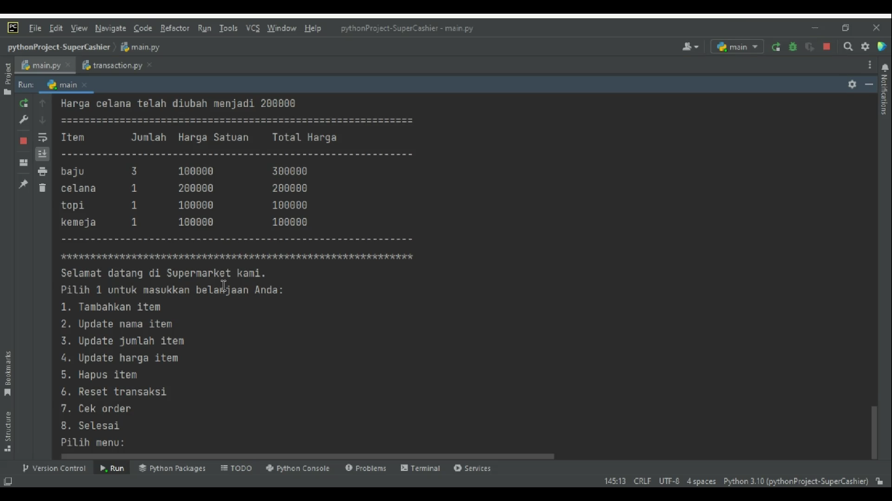
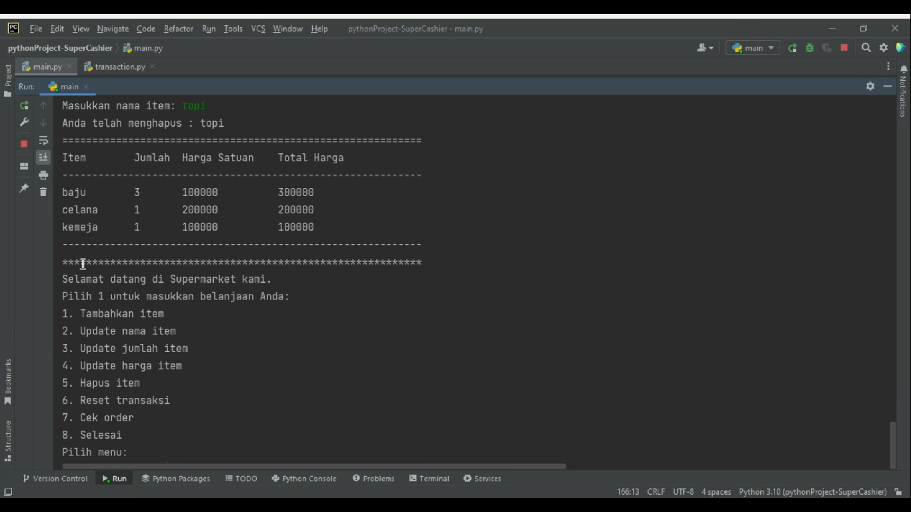
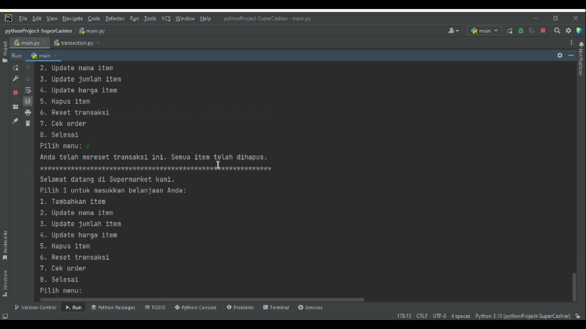
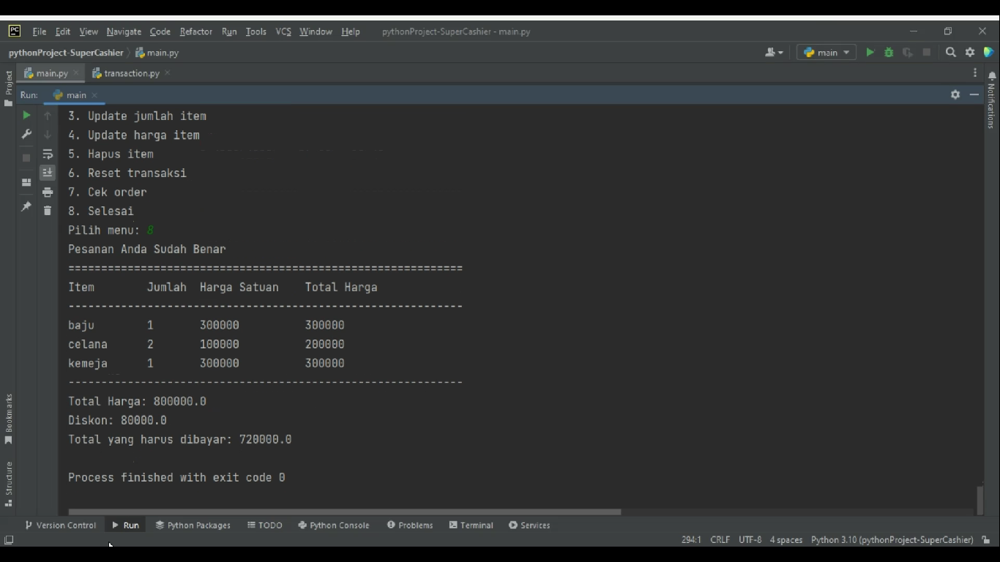

# Python Project Pacmann - Super Cashier
#### Ahmad Ilham Habibi - Analytics and Data Science - Batch 13

## Background Project

Andi adalah seorang pemilik supermarket besar di salah satu kota di Indonesia. Andi memiliki rencana untuk melakukan perbaikan proses bisnis, yaitu Andi akan membuat sistem kasir yang self-service di supermarket miliknya. Sehingga customer bisa langsung memasukkan item yang dibeli, dan harga item yang dibeli dan fitur yang lain.

## Feature Requirements

Akhirnya Andi meminta tolong kepada teman-teman selaku programmer Python untuk membuat program yang menyelesaikan problem tersebut.

Jika ada yang berbelanja, begini journey customer dalam membantu orang yang berbelanja tersebut.

#### 1. Customer membuat ID transaksi customer berikut:
- Dengan membuat objek dari class ``transct_123 = Transaction()``

#### 2. Kemudian customer memasukkan nama item, jumlah item, dan harga barang
- Masukkan item yang ingin dibeli.

    ``add_item([<nama item>, <jumlah item>, <harga per item>])``
     
#### 3. Jika terjadi kesalahan dalam memasukkan nama item atau jumlah item atau harga item tetapi tidak ingin menghapus itemnya, Customer bisa melakukan: 

a. Update nama item dengan method:

``update_item_name(<nama item>, <update nama item>)``

b. Update jumlah item dengan method:

``update_item_qty(<nama item>, <update jumlah item>)``

c. Update harga item dengan method:

``update_item_price(<nama item>, <update harga item>)``

#### 4. Jika batal membeli  item belanja, customer bisa melakukan:

a. menghapus salah satu item dari nama item dengan method:
``delet_item(<nama_item>)``

| Item                | jumlah item | harga per item | harga total |
|---------------------|-------------|----------------|-------------|
| mobil               | 2           | 100000         | 200000      |
| (item yang dihapus) |             |                |
| tempe               | 3           | 3000           | 9000        |

Ketika menghapus salah satu nama item, maka jumlah item dan harga per item pada baris/list tersebut akan ikut terhapus

b. Langsung menghapus semua transaksi atau reset transaksi dengan method:

``reset_transaction()``

#### 5. Customer sudah selesai dengan berbelanja online nya, tetapi Customer masih ragu apakah harga barang dan nama barang yang diinput sudah benar. Bisa saja customer melakukan kesalahan dalam melakukan input, semisal sudah melakukan input harga barang tetapi lupa untuk input nama barangnya. Bisa menggunakan method:
``check_order()``. Dengan ketentuan:

a. Akan mengeluarkan pesan "Pemesanan Sudah Benar"

b. Akan mengeluarkan pesan "Terdapat kesalahan input data"

c. Keluarkan output berikut:

| Item  | jumlah item | harga per item | harga total |
|-------|-------------|----------------|-------------|
| mobil | 2           | 100000         | 200000      |
| mie   | 1           | 5000           | 5000        |
| tempe | 3           | 3000           | 9000        |

#### 6. Setelah melakukan pengecekan, customer bisa menghiting total belanja yang sudah dibeli menggunakan method ``total_price()`` dengan ketentuan:

- Jika total belanja diatas 200.000 akan mendapat diskon 5%
- Jika total belanja diatas 300.000 akan mendapat diskon 8%
- Jika total belanja diatas 500.000 akan mendapat diskon 10%

Andi juga memberikan pesan kepada teman-teman kalau diberi kebebasan untuk menambahkan fitur yang lain apabila masih terdapat fitur yang belum tercover dalam sistem tersebut

## Flowchart

Flowchart untuk program Super Chasier adalah sebagai berikut:



## Penjelasan Fungsi dan Attribute

Project ini menggunakan dua file, yaitu :  ```main.py``` sebagai file utama yang akan dieksekusi, serta modul ```transaction.py``` yang berisi fungsi-fungsi untuk menjalankan program.

Pada modul ```transaction.py``` terdapat class ```Transaction()``` dengan fungsi-fungsi sebagai berikut:

- ```def __init__(self)```: Inisialisasi objek transaksi dengan atribut items, yaitu list kosong untuk menyimpan item-item yang akan dibeli.
- ```def add_item(self, item)```: Fungsi untuk menambahkan item ke dalam list items. Parameter, item (list): List yang berisi nama item, jumlah item, dan harga per item. Output berupa pesan yang memberitahu bahwa item sudah berhasil ditambahkan ke dalam list items.
- ```def update_item_name(self, old_name, new_name)```: Fungsi untuk mengganti nama item pada list items. Parameter: old_name (string): Nama item yang akan diganti. new_name (string): Nama baru untuk item yang akan diganti. Output: Pesan yang memberitahu bahwa nama item sudah berhasil diubah.
- ```def update_item_qty(self, name, qty)```: Fungsi untuk mengganti jumlah item pada list items. Parameter: name (string): Nama item yang ingin diubah jumlahnya. new_qty (int): Jumlah baru untuk item yang ingin diubah. Output: Pesan yang memberitahu bahwa jumlah item sudah berhasil diubah.
- ```def update_item_price(self, name, price)```: Fungsi untuk mengganti harga per item pada list items. Parameter: name (string): Nama item yang ingin diubah harganya. new_price (int): Harga per item yang baru untuk item yang ingin diubah. Output: Pesan yang memberitahu bahwa harga per item sudah berhasil diubah.
- ```def delete_item(self, name)```: Fungsi untuk menghapus item dari list items. Parameter: name (string): Nama item yang ingin dihapus dari list items. Output: Pesan yang memberitahu bahwa item sudah berhasil dihapus dari list items.
- ```def reset_transaction(self)```: Fungsi untuk menghapus semua item dari list items. Output: Pesan yang memberitahu bahwa semua item sudah berhasil dihapus dari list items.
- ```def check_order(self)```: Fungsi untuk mengecek apakah input data sudah benar atau tidak. Output: Jika semua input data sudah benar, fungsi akan mengeluarkan pesan "Pemesanan Anda Sudah Benar". Jika terdapat kesalahan pada input data, fungsi akan mengeluarkan pesan "Terdapat kesalahan input data". Jika input data sudah benar, fungsi akan mengeluarkan output berupa tabel berisi item, jumlah item harga satuan, dan total harga.
- ```def show_items(self)```: Fungsi untuk menampilkan nama item, jumlah item, harga satuan dan total harga Output: Tabel nama item, jumlah item, harga satuan dan total harga.
- ```def total_price(self)```: Fungsi untuk menghitung total harga dari seluruh item pada list items. Output: Total harga dari seluruh item pada list items.


## Test Case

1. Menu Utama

    Setelah  mengeksekusi file ```main.py``` maka akan muncul menu utama yang berisi pilihan untuk menambah item, update nama item, update jumlah item, update harga item, hapus item, reset transaksi, cek order, dan harga total.
    
    
   
2. Tambahkan Item
    
    Gunakan method ```add_item()``` untuk membahkan item yang ingin dibeli.
    

3. Update Nama Item
    
    Gunakan method ```update_item_name()``` untuk mengubah nama item yang dibeli.
    

4. Update Jumlah Item
    
    Gunakan method ```update_item_qty()``` untuk mengubah jumlah item yang ingin dibeli.
    

5. Update Harga Item
    
    Gunakan method ```update_item_price()``` untuk mengubah item yang ingin dibeli.
    

6. Hapus Item
    
    Gunakan method ```delete_item()``` untuk memhapus item tertentu.
    

7. Reset Transaksi
    
    Gunakan method ```reset_transaction()``` untuk menghapus semua item.
    

8. Cek Order
    
    Gunakan method ```check_order()``` untuk mengecek apakah order sudah sesuai atau belum.
    Ketika selesai akan otomatis mengeksekusi fungsi ```show_items()``` dan ```total_price()```
    

    Untuk test case yang lebih jelas bisa dilihat pada video berikut:
    https://youtu.be/eTrZchTMbRI

## Pengembangan Selanjutnya

Menggunakan modul Flask untuk memperbaiki tampilan serta menggunakan sqllite3 sebagai penyimpanan database.
   
